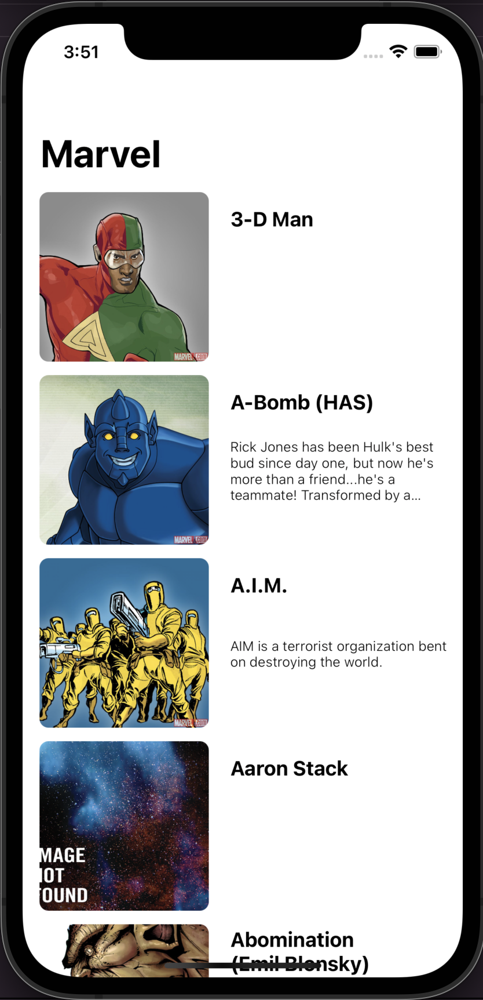
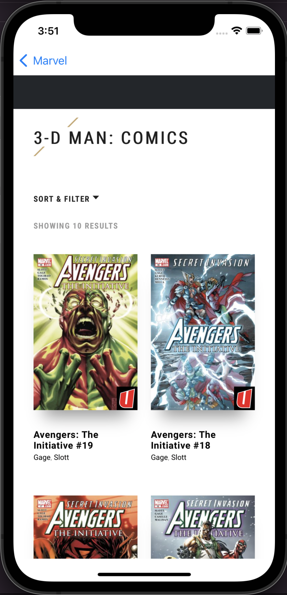

# MarvelAPI
MarvelAPI iOS Swift es una aplicación escrita en Swift 5 usando los conceptos de la Arquitectura MVC 🚀.

La pantalla de Personajes, muestra todos los personajes a través una consulta a la API de Marvel. Luego lista los resultados y cada Personaje puede ir al detalle a través de una WebView. 

## Requerimientos

- Swift 5.0+
- Xcode 13.0+
- iOS 14.0+ 

## ScreenShots 

| Personajes | Detalle |
| :-: | :-: |
|  |  | 

## Librerias Usadas

* [**CryptoKit**](https://developer.apple.com/documentation/cryptokit/)
* [**WebKit**](https://developer.apple.com/documentation/webkit)

## Instalación

* Descargar el proyecto.
* Seleccionar su Team y regenerar los certificados con su cuenta de Apple. 
* Compilar el proyecto

## Test

* Se agregaron Test Unitarios para verificar los llamados a la API de Marvel y verificar diferentes estados del endpoint.
* También se agrego un TestUI para probar el funcionamiento de un usuario real. Sin embargo como la API tiene 3000 llamados por día no es recomendable ejecutar el TestUI continuamente. 
* Compilar Test en modo debug.
  
## Author

* [**Maximiliano Morales**](https://github.com/maximorales90)
